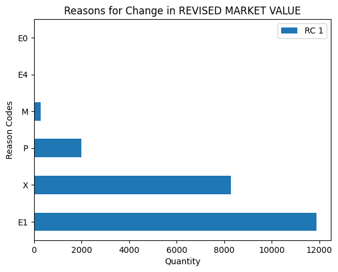

New York City Department of Finance
Revised Notice of Property Value (RNOPV)
# AI Analysis and Prediction of Property Values in NYC Using a Multiple Linear Regression Model
By: Tyriek Thomas

## Video Presentation  
[](https://drive.google.com/file/d/1Ueubw28rlulqzOrjcaMES0b-dDuXRC8z/view?usp=sharing)  
[Click me](https://drive.google.com/file/d/1Ueubw28rlulqzOrjcaMES0b-dDuXRC8z/view?usp=sharing)

---

## Slideshow Presentation  
[](https://docs.google.com/presentation/d/18tj92hkFsVPnvjZmd58wT2esmQMQkjVtVgfTBzB6cmA/edit?usp=sharing)  
[Click me](https://docs.google.com/presentation/d/18tj92hkFsVPnvjZmd58wT2esmQMQkjVtVgfTBzB6cmA/edit?usp=sharing)
Source: https://data.cityofnewyork.us/City-Government/Revised-Notice-of-Property-Value-RNOPV-/8vgb-zm6e


# Background on RNOPV
Revised Notice of Property Value

At the start of each year, the NYC Department of Finance contacts property owners to update them on their properties’ new “Revised Market Value” based on their previous “Original Market Value”, “Original Assessed Value”, and “Original Taxable Value” information that they received from the previous year.

A properties’ “Revised Market Value” can either increase, decrease or remain unchanged based on a number of different economic, tax based, or physical reasons.

For this project I will consider the perspective of a NYC property owner who would like to use the “Original Assessed Value”, “Original Taxable Value”, and “Original Market Value” from the previous year to predict the potential “Revised Market Value”

## Selecting Features From Dataset
Preprocessing the data from the NYC Department of Finance. I selected 7 features from the 39 features included in the dataset. 

Features were selected based on the weighted influence and contribution to the target feature.

Borough - More Precise Location within NYC
BLD Class - Type of building category determined by characteristics such as size/number of rooms can be ranked
Original Assessed Value 
Original Taxable Value
Original Market Value
Revised Market Value
RC1 - Reason Code 1 

# Preparing Features For Regression Model

## Categorical Data:
Borough - Nominal
RC1- Nominal
## Numerical Data:
Original Assed Value 
Original Taxable Value
Original Market Value
Revised Market Value 

## Target - Revised Market Value 

# Visualize Target For Regression Model


max=347,000,000
mean=3,020,000
q1=224,109
q2 median=443,000
q3=853,000
IQR = (q3 - q1)  - 50 percent of the data is squeezed in between 
the range of (224,109:853,000.
IQR = 853,000 - 224,109 = 628,891
Q3+(1.5*IQR) = Q3 + 943,336.5 = 853,000 + 943,336 = 1,896,336.5 (Upper Bound Error)
The target value consists of a broad range of property values in NYC ranging from a single family home  in Staten Island to MultiMillion dollar Skyscrapers in  Manhattan.
Due to such a broad range of numerical data? How accurate can my predictions be?
Very accurate thanks to the [RC 1] and [BOROUGH] categorical features.


# Visualize  of Numerical Features For Regression Model


Because we have the numerical features Original Assessed Taxable and Market values  along with the Revised values I can train my model make an accurate prediction for revised market value.

While yearly inflation is responsible for an expected increase in [REVISED MARKET VALUE], sometimes the housing market fluctuates and the market rates will be undervalued to meet demand.

In addition, the [ORIGINAL TAXABLE VALUE] is a variable that has a set formula to determine the taxable value based on the properties’ [ORIGINAL ASSESSED VALUE], properties can qualify for tax exemptions or even increases in taxes for the year based on reason codes [RC 1].

# Visualize  of Categorical Features For Regression Model


The reason code Rc 1 is responsible for explaining why there is a change in the original market value to the new revised market value.
RC 1:The reason codes are
E0 - was fully Sales Exempt now retsored to taxable status
E1 - Economics (deduction)
E4 - Economics (initiated by taxpayer)
M - MV 
P - Physical Change 
X - Exempt Value Change unless fully


The Borough is a very critical feature in training our model, duecause Manhattan is the most expensive places to own property in one the most expensive cities in the world. If about 50% of the dataset is from Manhattan Properties, it is important to distinguish the rows of data from other Boroughs where property values aren’t as high.

# Multiple Linear Regression  Model Implementation
Can we predict numerical features such as the “Revised Market Value” for a specified property in NYC? 
By training our linear regression model with historical data and features that correlate with the target numerical feature, we can successfully estimate/predict a value that correlates with the given data.
Within a margin of statistical error.

# Train, Test and Split Multiple Linear Regression Model


r2: 0.9328671776570595
The percentage of data having a variance that can be explained by the variance in the independent variables.
root mean squared error:3047891.8278787048
The average squared root of the error (y_test - y_pred)
The difference is squared, summed and averaged in order to handle negative and positive distances of the error. The root mean squared error can be used to calculate error bars(residuals).


In this project I will be using 12 out of the 27 total features provided for optimization.

```python
import numpy as np
import pandas as pd
import matplotlib.pyplot as plt
from sklearn.linear_model import LinearRegression
from sklearn.model_selection import train_test_split
from sklearn.metrics import r2_score, mean_squared_error

#step1 import Data Set
url = 'https://drive.google.com/file/d/1h6MQWuoikbjDOFVVV25p1ORrJnK54v6F/view?usp=sharing'
path = 'https://drive.google.com/uc?export=download&id='+url.split('/')[-2]
df = pd.read_csv(path)
df = df[['Borough','BLD Class','ORIGINAL ASSESSED VALUE', 'REVISED ASSESSED VALUE','ORIGINAL TAXABLE VALUE', 'REVISED TAXABLE VALUE', 'ORIGINAL MARKET VALUE', 'REVISED MARKET VALUE', 'RC 1']]
#df.info()

#pre processing part1 - clean data
#The only  colums we need are CATAGORIES BORO, CUISINE DESCRIPTION AND THE TARGET SCORE
#initdf=df[['Borough','ORIGINAL ASSESSED VALUE','ORIGINAL TAXABLE VALUE', 'ORIGINAL MARKET VALUE', 'REVISED ASSESSED VALUE', 'REVISED MARKET VALUE', 'RC 1']]
#Now we clean the data by droping rows with score of NAN as not useful
#df=df.dropna(axis=0,how='any',subset=['Borough','RC 1']) #if a catagorical is null drop the row
df1=df.dropna(axis=0,how='any',subset=['Borough','RC 1','ORIGINAL MARKET VALUE','REVISED MARKET VALUE'])

df1=df1.fillna(0)
df1.info()


# heatmap1 = df1.corr()
# plt.figure(figsize=(6, 5))
# sns.heatmap(correlations, annot=True, cmap='coolwarm', fmt=".2f", linewidths=.5)
# plt.title('Correlation Heatmap')
# plt.show()

df1
```

    <class 'pandas.core.frame.DataFrame'>
    Int64Index: 22424 entries, 4 to 27311
    Data columns (total 9 columns):
     #   Column                   Non-Null Count  Dtype  
    ---  ------                   --------------  -----  
     0   Borough                  22424 non-null  object 
     1   BLD Class                22424 non-null  object 
     2   ORIGINAL ASSESSED VALUE  22424 non-null  float64
     3   REVISED ASSESSED VALUE   22424 non-null  float64
     4   ORIGINAL TAXABLE VALUE   22424 non-null  float64
     5   REVISED TAXABLE VALUE    22424 non-null  float64
     6   ORIGINAL MARKET VALUE    22424 non-null  float64
     7   REVISED MARKET VALUE     22424 non-null  float64
     8   RC 1                     22424 non-null  object 
    dtypes: float64(6), object(3)
    memory usage: 1.7+ MB


  <div id="df-b83a4e4c-0c47-4e71-9b8a-795d83b9397f" class="colab-df-container">
    <div>
<style scoped>
    .dataframe tbody tr th:only-of-type {
        vertical-align: middle;
    }

    .dataframe tbody tr th {
        vertical-align: top;
    }

    .dataframe thead th {
        text-align: right;
    }
</style>
<table border="1" class="dataframe">
  <thead>
    <tr style="text-align: right;">
      <th></th>
      <th>Borough</th>
      <th>BLD Class</th>
      <th>ORIGINAL ASSESSED VALUE</th>
      <th>REVISED ASSESSED VALUE</th>
      <th>ORIGINAL TAXABLE VALUE</th>
      <th>REVISED TAXABLE VALUE</th>
      <th>ORIGINAL MARKET VALUE</th>
      <th>REVISED MARKET VALUE</th>
      <th>RC 1</th>
    </tr>
  </thead>
  <tbody>
    <tr>
      <th>4</th>
      <td>MANHATTAN</td>
      <td>B2</td>
      <td>62520.0</td>
      <td>62520.0</td>
      <td>56830.0</td>
      <td>56830.0</td>
      <td>2298000.0</td>
      <td>2758000.0</td>
      <td>M</td>
    </tr>
    <tr>
      <th>7</th>
      <td>BROOKLYN</td>
      <td>B2</td>
      <td>35512.0</td>
      <td>35512.0</td>
      <td>35512.0</td>
      <td>35512.0</td>
      <td>650000.0</td>
      <td>670000.0</td>
      <td>M</td>
    </tr>
    <tr>
      <th>8</th>
      <td>BROOKLYN</td>
      <td>A1</td>
      <td>58711.0</td>
      <td>58711.0</td>
      <td>58711.0</td>
      <td>58711.0</td>
      <td>1053000.0</td>
      <td>1085000.0</td>
      <td>M</td>
    </tr>
    <tr>
      <th>10</th>
      <td>BROOKLYN</td>
      <td>A1</td>
      <td>51520.0</td>
      <td>51520.0</td>
      <td>51520.0</td>
      <td>51520.0</td>
      <td>1116000.0</td>
      <td>1150000.0</td>
      <td>M</td>
    </tr>
    <tr>
      <th>11</th>
      <td>BROOKLYN</td>
      <td>A1</td>
      <td>48469.0</td>
      <td>48469.0</td>
      <td>48469.0</td>
      <td>48469.0</td>
      <td>986000.0</td>
      <td>1016000.0</td>
      <td>M</td>
    </tr>
    <tr>
      <th>...</th>
      <td>...</td>
      <td>...</td>
      <td>...</td>
      <td>...</td>
      <td>...</td>
      <td>...</td>
      <td>...</td>
      <td>...</td>
      <td>...</td>
    </tr>
    <tr>
      <th>27307</th>
      <td>STATEN IS</td>
      <td>A1</td>
      <td>28365.0</td>
      <td>28365.0</td>
      <td>26815.0</td>
      <td>28365.0</td>
      <td>597000.0</td>
      <td>597000.0</td>
      <td>X</td>
    </tr>
    <tr>
      <th>27308</th>
      <td>STATEN IS</td>
      <td>B2</td>
      <td>30816.0</td>
      <td>30816.0</td>
      <td>9958.0</td>
      <td>30816.0</td>
      <td>567000.0</td>
      <td>567000.0</td>
      <td>X</td>
    </tr>
    <tr>
      <th>27309</th>
      <td>STATEN IS</td>
      <td>E9</td>
      <td>20293.0</td>
      <td>128700.0</td>
      <td>20293.0</td>
      <td>41055.0</td>
      <td>440000.0</td>
      <td>286000.0</td>
      <td>E1</td>
    </tr>
    <tr>
      <th>27310</th>
      <td>STATEN IS</td>
      <td>A5</td>
      <td>18735.0</td>
      <td>18735.0</td>
      <td>17185.0</td>
      <td>18735.0</td>
      <td>368000.0</td>
      <td>368000.0</td>
      <td>X</td>
    </tr>
    <tr>
      <th>27311</th>
      <td>STATEN IS</td>
      <td>K4</td>
      <td>25415.0</td>
      <td>105750.0</td>
      <td>25415.0</td>
      <td>40331.0</td>
      <td>429000.0</td>
      <td>235000.0</td>
      <td>E1</td>
    </tr>
  </tbody>
</table>
<p>22424 rows × 9 columns</p>
</div>
    <div class="colab-df-buttons">

  <div class="colab-df-container">
    <button class="colab-df-convert" onclick="convertToInteractive('df-b83a4e4c-0c47-4e71-9b8a-795d83b9397f')"
            title="Convert this dataframe to an interactive table."
            style="display:none;">

  <svg xmlns="http://www.w3.org/2000/svg" height="24px" viewBox="0 -960 960 960">
    <path d="M120-120v-720h720v720H120Zm60-500h600v-160H180v160Zm220 220h160v-160H400v160Zm0 220h160v-160H400v160ZM180-400h160v-160H180v160Zm440 0h160v-160H620v160ZM180-180h160v-160H180v160Zm440 0h160v-160H620v160Z"/>
  </svg>
    </button>

  <style>
    .colab-df-container {
      display:flex;
      gap: 12px;
    }

    .colab-df-convert {
      background-color: #E8F0FE;
      border: none;
      border-radius: 50%;
      cursor: pointer;
      display: none;
      fill: #1967D2;
      height: 32px;
      padding: 0 0 0 0;
      width: 32px;
    }

    .colab-df-convert:hover {
      background-color: #E2EBFA;
      box-shadow: 0px 1px 2px rgba(60, 64, 67, 0.3), 0px 1px 3px 1px rgba(60, 64, 67, 0.15);
      fill: #174EA6;
    }

    .colab-df-buttons div {
      margin-bottom: 4px;
    }

    [theme=dark] .colab-df-convert {
      background-color: #3B4455;
      fill: #D2E3FC;
    }

    [theme=dark] .colab-df-convert:hover {
      background-color: #434B5C;
      box-shadow: 0px 1px 3px 1px rgba(0, 0, 0, 0.15);
      filter: drop-shadow(0px 1px 2px rgba(0, 0, 0, 0.3));
      fill: #FFFFFF;
    }
  </style>

    <script>
      const buttonEl =
        document.querySelector('#df-b83a4e4c-0c47-4e71-9b8a-795d83b9397f button.colab-df-convert');
      buttonEl.style.display =
        google.colab.kernel.accessAllowed ? 'block' : 'none';

      async function convertToInteractive(key) {
        const element = document.querySelector('#df-b83a4e4c-0c47-4e71-9b8a-795d83b9397f');
        const dataTable =
          await google.colab.kernel.invokeFunction('convertToInteractive',
                                                    [key], {});
        if (!dataTable) return;

        const docLinkHtml = 'Like what you see? Visit the ' +
          '<a target="_blank" href=https://colab.research.google.com/notebooks/data_table.ipynb>data table notebook</a>'
          + ' to learn more about interactive tables.';
        element.innerHTML = '';
        dataTable['output_type'] = 'display_data';
        await google.colab.output.renderOutput(dataTable, element);
        const docLink = document.createElement('div');
        docLink.innerHTML = docLinkHtml;
        element.appendChild(docLink);
      }
    </script>
  </div>


<div id="df-681c7903-28db-44d6-8dab-c66d0ce3bc0a">
  <button class="colab-df-quickchart" onclick="quickchart('df-681c7903-28db-44d6-8dab-c66d0ce3bc0a')"
            title="Suggest charts"
            style="display:none;">

<svg xmlns="http://www.w3.org/2000/svg" height="24px"viewBox="0 0 24 24"
     width="24px">
    <g>
        <path d="M19 3H5c-1.1 0-2 .9-2 2v14c0 1.1.9 2 2 2h14c1.1 0 2-.9 2-2V5c0-1.1-.9-2-2-2zM9 17H7v-7h2v7zm4 0h-2V7h2v10zm4 0h-2v-4h2v4z"/>
    </g>
</svg>
  </button>

<style>
  .colab-df-quickchart {
      --bg-color: #E8F0FE;
      --fill-color: #1967D2;
      --hover-bg-color: #E2EBFA;
      --hover-fill-color: #174EA6;
      --disabled-fill-color: #AAA;
      --disabled-bg-color: #DDD;
  }

  [theme=dark] .colab-df-quickchart {
      --bg-color: #3B4455;
      --fill-color: #D2E3FC;
      --hover-bg-color: #434B5C;
      --hover-fill-color: #FFFFFF;
      --disabled-bg-color: #3B4455;
      --disabled-fill-color: #666;
  }

  .colab-df-quickchart {
    background-color: var(--bg-color);
    border: none;
    border-radius: 50%;
    cursor: pointer;
    display: none;
    fill: var(--fill-color);
    height: 32px;
    padding: 0;
    width: 32px;
  }

  .colab-df-quickchart:hover {
    background-color: var(--hover-bg-color);
    box-shadow: 0 1px 2px rgba(60, 64, 67, 0.3), 0 1px 3px 1px rgba(60, 64, 67, 0.15);
    fill: var(--button-hover-fill-color);
  }

  .colab-df-quickchart-complete:disabled,
  .colab-df-quickchart-complete:disabled:hover {
    background-color: var(--disabled-bg-color);
    fill: var(--disabled-fill-color);
    box-shadow: none;
  }

  .colab-df-spinner {
    border: 2px solid var(--fill-color);
    border-color: transparent;
    border-bottom-color: var(--fill-color);
    animation:
      spin 1s steps(1) infinite;
  }

  @keyframes spin {
    0% {
      border-color: transparent;
      border-bottom-color: var(--fill-color);
      border-left-color: var(--fill-color);
    }
    20% {
      border-color: transparent;
      border-left-color: var(--fill-color);
      border-top-color: var(--fill-color);
    }
    30% {
      border-color: transparent;
      border-left-color: var(--fill-color);
      border-top-color: var(--fill-color);
      border-right-color: var(--fill-color);
    }
    40% {
      border-color: transparent;
      border-right-color: var(--fill-color);
      border-top-color: var(--fill-color);
    }
    60% {
      border-color: transparent;
      border-right-color: var(--fill-color);
    }
    80% {
      border-color: transparent;
      border-right-color: var(--fill-color);
      border-bottom-color: var(--fill-color);
    }
    90% {
      border-color: transparent;
      border-bottom-color: var(--fill-color);
    }
  }
</style>

  <script>
    async function quickchart(key) {
      const quickchartButtonEl =
        document.querySelector('#' + key + ' button');
      quickchartButtonEl.disabled = true;  // To prevent multiple clicks.
      quickchartButtonEl.classList.add('colab-df-spinner');
      try {
        const charts = await google.colab.kernel.invokeFunction(
            'suggestCharts', [key], {});
      } catch (error) {
        console.error('Error during call to suggestCharts:', error);
      }
      quickchartButtonEl.classList.remove('colab-df-spinner');
      quickchartButtonEl.classList.add('colab-df-quickchart-complete');
    }
    (() => {
      let quickchartButtonEl =
        document.querySelector('#df-681c7903-28db-44d6-8dab-c66d0ce3bc0a button');
      quickchartButtonEl.style.display =
        google.colab.kernel.accessAllowed ? 'block' : 'none';
    })();
  </script>
</div>
    </div>
  </div>


```python
plt.scatter(df1["ORIGINAL MARKET VALUE"],df1["REVISED MARKET VALUE"], color='skyblue', label=["REVISED MARKET VALUE"])
plt.scatter(df1["ORIGINAL MARKET VALUE"],df1["ORIGINAL MARKET VALUE"], color='blue', label=["ORIGIONAL MARKET VALUE"])

plt.xlabel('(x) value in USD compared to ORIGINAL MARKET VALUE')
plt.ylabel('(y) Value in USD')
plt.ticklabel_format(axis="both",style="plain")
plt.xticks(rotation=15)

plt.title('ORIGINAL MARKET VALUE VS REVISED MARKET VALUE')
plt.legend()
plt.show()

#Because we have the Origional Assesed Taxable and Market values  along with the Revised values I can train my model make an accurate prediction for revised market value
#My model will be even more precise because I used one hot encoding to input the Boro and Reason code into my model

#The reason code Rc 1 is responsible for explaining why there is a change in the origional market value to the new revised market value.
#The reason codes are
# E0 - was fully Sales Exempt now retsored to taxable status
# E1 - Economics
# E4 - Economics (initiated by taxpayer)
# M - MV
# P - Physical Change
# X - Exempt Value Change unless fully
#visualizing the categorical features
#rcodes=df1["RC 1"]
q=df1["RC 1"].value_counts().plot(kind="barh")
#plt.bar(rcodes,height=q, color="orange")
plt.ylabel('Reason Codes')
plt.xlabel('Quantity')
plt.title('Reasons for Change in REVISED MARKET VALUE')
plt.legend()
plt.show()

#print(df1["REVISED MARKET VALUE"][100:150])
#rcodes

q=df1["Borough"].value_counts().plot(kind="barh")
#plt.bar(rcodes,height=q, color="orange")
plt.ylabel('BOROUGH')
plt.xlabel('Quantity')
plt.title('BOROUGH CATAGORY REVISED MARKET VALUE')
plt.legend()
plt.show()
```


    

    


    

    


    

    


```python
plt.scatter(df1["ORIGINAL MARKET VALUE"],df1["ORIGINAL TAXABLE VALUE"],color='orange',label=["ORIGIONAL TAXABLE VALUE"])
plt.scatter(df1["ORIGINAL MARKET VALUE"],df1["ORIGINAL ASSESSED VALUE"],color='green',label=["ORIGIONAL ASSESSED VALUE"])
plt.scatter(df1["ORIGINAL MARKET VALUE"],df1["REVISED MARKET VALUE"],color='skyblue',label=["REVISED MARKET VALUE"])
plt.scatter(df1["ORIGINAL MARKET VALUE"],df1["ORIGINAL MARKET VALUE"],color='blue',label=["ORIGIONAL MARKET VALUE"])


plt.xlabel('(x) value in USD compared to ORIGINAL MARKET VALUE')
plt.ylabel('(y) Value in USD')
plt.ticklabel_format(axis="both",style="plain")
plt.xticks(rotation=15)
plt.title('Numerical Property Value Data Compared')
plt.legend()
plt.show()
```


    

    


```python
#one hot encode catagorical data into numerical column representations
one_hot_encoded = pd.get_dummies(df1, columns=['RC 1','Borough'],prefix=["R","BORO"])
#one_hot_encoded

#///////////////
one_hot_encoded = one_hot_encoded.drop(["BLD Class","REVISED ASSESSED VALUE","REVISED TAXABLE VALUE"],axis=1)
#droped the building class column due to too many catagories (100+)
#including the buiding class may have increased accuracy of model, havever it may have been impractical for one hot encoding into numerical data

# correlations = one_hot_encoded.corr()
# plt.figure(figsize=(10, 8))
# sns.heatmap(correlations, annot=True, cmap='coolwarm', fmt=".2f", linewidths=.5)
# plt.title('Correlation Heatmap')
# plt.show()

one_hot_encoded


```


  <div id="df-dc94fa15-3d69-4364-84b9-a7fe4da0636c" class="colab-df-container">
    <div>
<style scoped>
    .dataframe tbody tr th:only-of-type {
        vertical-align: middle;
    }

    .dataframe tbody tr th {
        vertical-align: top;
    }

    .dataframe thead th {
        text-align: right;
    }
</style>
<table border="1" class="dataframe">
  <thead>
    <tr style="text-align: right;">
      <th></th>
      <th>ORIGINAL ASSESSED VALUE</th>
      <th>ORIGINAL TAXABLE VALUE</th>
      <th>ORIGINAL MARKET VALUE</th>
      <th>REVISED MARKET VALUE</th>
      <th>R_E0</th>
      <th>R_E1</th>
      <th>R_E4</th>
      <th>R_M</th>
      <th>R_P</th>
      <th>R_X</th>
      <th>BORO_BRONX</th>
      <th>BORO_BROOKLYN</th>
      <th>BORO_MANHATTAN</th>
      <th>BORO_QUEENS</th>
      <th>BORO_STATEN IS</th>
    </tr>
  </thead>
  <tbody>
    <tr>
      <th>4</th>
      <td>62520.0</td>
      <td>56830.0</td>
      <td>2298000.0</td>
      <td>2758000.0</td>
      <td>0</td>
      <td>0</td>
      <td>0</td>
      <td>1</td>
      <td>0</td>
      <td>0</td>
      <td>0</td>
      <td>0</td>
      <td>1</td>
      <td>0</td>
      <td>0</td>
    </tr>
    <tr>
      <th>7</th>
      <td>35512.0</td>
      <td>35512.0</td>
      <td>650000.0</td>
      <td>670000.0</td>
      <td>0</td>
      <td>0</td>
      <td>0</td>
      <td>1</td>
      <td>0</td>
      <td>0</td>
      <td>0</td>
      <td>1</td>
      <td>0</td>
      <td>0</td>
      <td>0</td>
    </tr>
    <tr>
      <th>8</th>
      <td>58711.0</td>
      <td>58711.0</td>
      <td>1053000.0</td>
      <td>1085000.0</td>
      <td>0</td>
      <td>0</td>
      <td>0</td>
      <td>1</td>
      <td>0</td>
      <td>0</td>
      <td>0</td>
      <td>1</td>
      <td>0</td>
      <td>0</td>
      <td>0</td>
    </tr>
    <tr>
      <th>10</th>
      <td>51520.0</td>
      <td>51520.0</td>
      <td>1116000.0</td>
      <td>1150000.0</td>
      <td>0</td>
      <td>0</td>
      <td>0</td>
      <td>1</td>
      <td>0</td>
      <td>0</td>
      <td>0</td>
      <td>1</td>
      <td>0</td>
      <td>0</td>
      <td>0</td>
    </tr>
    <tr>
      <th>11</th>
      <td>48469.0</td>
      <td>48469.0</td>
      <td>986000.0</td>
      <td>1016000.0</td>
      <td>0</td>
      <td>0</td>
      <td>0</td>
      <td>1</td>
      <td>0</td>
      <td>0</td>
      <td>0</td>
      <td>1</td>
      <td>0</td>
      <td>0</td>
      <td>0</td>
    </tr>
    <tr>
      <th>...</th>
      <td>...</td>
      <td>...</td>
      <td>...</td>
      <td>...</td>
      <td>...</td>
      <td>...</td>
      <td>...</td>
      <td>...</td>
      <td>...</td>
      <td>...</td>
      <td>...</td>
      <td>...</td>
      <td>...</td>
      <td>...</td>
      <td>...</td>
    </tr>
    <tr>
      <th>27307</th>
      <td>28365.0</td>
      <td>26815.0</td>
      <td>597000.0</td>
      <td>597000.0</td>
      <td>0</td>
      <td>0</td>
      <td>0</td>
      <td>0</td>
      <td>0</td>
      <td>1</td>
      <td>0</td>
      <td>0</td>
      <td>0</td>
      <td>0</td>
      <td>1</td>
    </tr>
    <tr>
      <th>27308</th>
      <td>30816.0</td>
      <td>9958.0</td>
      <td>567000.0</td>
      <td>567000.0</td>
      <td>0</td>
      <td>0</td>
      <td>0</td>
      <td>0</td>
      <td>0</td>
      <td>1</td>
      <td>0</td>
      <td>0</td>
      <td>0</td>
      <td>0</td>
      <td>1</td>
    </tr>
    <tr>
      <th>27309</th>
      <td>20293.0</td>
      <td>20293.0</td>
      <td>440000.0</td>
      <td>286000.0</td>
      <td>0</td>
      <td>1</td>
      <td>0</td>
      <td>0</td>
      <td>0</td>
      <td>0</td>
      <td>0</td>
      <td>0</td>
      <td>0</td>
      <td>0</td>
      <td>1</td>
    </tr>
    <tr>
      <th>27310</th>
      <td>18735.0</td>
      <td>17185.0</td>
      <td>368000.0</td>
      <td>368000.0</td>
      <td>0</td>
      <td>0</td>
      <td>0</td>
      <td>0</td>
      <td>0</td>
      <td>1</td>
      <td>0</td>
      <td>0</td>
      <td>0</td>
      <td>0</td>
      <td>1</td>
    </tr>
    <tr>
      <th>27311</th>
      <td>25415.0</td>
      <td>25415.0</td>
      <td>429000.0</td>
      <td>235000.0</td>
      <td>0</td>
      <td>1</td>
      <td>0</td>
      <td>0</td>
      <td>0</td>
      <td>0</td>
      <td>0</td>
      <td>0</td>
      <td>0</td>
      <td>0</td>
      <td>1</td>
    </tr>
  </tbody>
</table>
<p>22424 rows × 15 columns</p>
</div>
    <div class="colab-df-buttons">

  <div class="colab-df-container">
    <button class="colab-df-convert" onclick="convertToInteractive('df-dc94fa15-3d69-4364-84b9-a7fe4da0636c')"
            title="Convert this dataframe to an interactive table."
            style="display:none;">

  <svg xmlns="http://www.w3.org/2000/svg" height="24px" viewBox="0 -960 960 960">
    <path d="M120-120v-720h720v720H120Zm60-500h600v-160H180v160Zm220 220h160v-160H400v160Zm0 220h160v-160H400v160ZM180-400h160v-160H180v160Zm440 0h160v-160H620v160ZM180-180h160v-160H180v160Zm440 0h160v-160H620v160Z"/>
  </svg>
    </button>

  <style>
    .colab-df-container {
      display:flex;
      gap: 12px;
    }

    .colab-df-convert {
      background-color: #E8F0FE;
      border: none;
      border-radius: 50%;
      cursor: pointer;
      display: none;
      fill: #1967D2;
      height: 32px;
      padding: 0 0 0 0;
      width: 32px;
    }

    .colab-df-convert:hover {
      background-color: #E2EBFA;
      box-shadow: 0px 1px 2px rgba(60, 64, 67, 0.3), 0px 1px 3px 1px rgba(60, 64, 67, 0.15);
      fill: #174EA6;
    }

    .colab-df-buttons div {
      margin-bottom: 4px;
    }

    [theme=dark] .colab-df-convert {
      background-color: #3B4455;
      fill: #D2E3FC;
    }

    [theme=dark] .colab-df-convert:hover {
      background-color: #434B5C;
      box-shadow: 0px 1px 3px 1px rgba(0, 0, 0, 0.15);
      filter: drop-shadow(0px 1px 2px rgba(0, 0, 0, 0.3));
      fill: #FFFFFF;
    }
  </style>

    <script>
      const buttonEl =
        document.querySelector('#df-dc94fa15-3d69-4364-84b9-a7fe4da0636c button.colab-df-convert');
      buttonEl.style.display =
        google.colab.kernel.accessAllowed ? 'block' : 'none';

      async function convertToInteractive(key) {
        const element = document.querySelector('#df-dc94fa15-3d69-4364-84b9-a7fe4da0636c');
        const dataTable =
          await google.colab.kernel.invokeFunction('convertToInteractive',
                                                    [key], {});
        if (!dataTable) return;

        const docLinkHtml = 'Like what you see? Visit the ' +
          '<a target="_blank" href=https://colab.research.google.com/notebooks/data_table.ipynb>data table notebook</a>'
          + ' to learn more about interactive tables.';
        element.innerHTML = '';
        dataTable['output_type'] = 'display_data';
        await google.colab.output.renderOutput(dataTable, element);
        const docLink = document.createElement('div');
        docLink.innerHTML = docLinkHtml;
        element.appendChild(docLink);
      }
    </script>
  </div>


<div id="df-df85f1de-0987-4a40-9e86-52da28f90d41">
  <button class="colab-df-quickchart" onclick="quickchart('df-df85f1de-0987-4a40-9e86-52da28f90d41')"
            title="Suggest charts"
            style="display:none;">

<svg xmlns="http://www.w3.org/2000/svg" height="24px"viewBox="0 0 24 24"
     width="24px">
    <g>
        <path d="M19 3H5c-1.1 0-2 .9-2 2v14c0 1.1.9 2 2 2h14c1.1 0 2-.9 2-2V5c0-1.1-.9-2-2-2zM9 17H7v-7h2v7zm4 0h-2V7h2v10zm4 0h-2v-4h2v4z"/>
    </g>
</svg>
  </button>

<style>
  .colab-df-quickchart {
      --bg-color: #E8F0FE;
      --fill-color: #1967D2;
      --hover-bg-color: #E2EBFA;
      --hover-fill-color: #174EA6;
      --disabled-fill-color: #AAA;
      --disabled-bg-color: #DDD;
  }

  [theme=dark] .colab-df-quickchart {
      --bg-color: #3B4455;
      --fill-color: #D2E3FC;
      --hover-bg-color: #434B5C;
      --hover-fill-color: #FFFFFF;
      --disabled-bg-color: #3B4455;
      --disabled-fill-color: #666;
  }

  .colab-df-quickchart {
    background-color: var(--bg-color);
    border: none;
    border-radius: 50%;
    cursor: pointer;
    display: none;
    fill: var(--fill-color);
    height: 32px;
    padding: 0;
    width: 32px;
  }

  .colab-df-quickchart:hover {
    background-color: var(--hover-bg-color);
    box-shadow: 0 1px 2px rgba(60, 64, 67, 0.3), 0 1px 3px 1px rgba(60, 64, 67, 0.15);
    fill: var(--button-hover-fill-color);
  }

  .colab-df-quickchart-complete:disabled,
  .colab-df-quickchart-complete:disabled:hover {
    background-color: var(--disabled-bg-color);
    fill: var(--disabled-fill-color);
    box-shadow: none;
  }

  .colab-df-spinner {
    border: 2px solid var(--fill-color);
    border-color: transparent;
    border-bottom-color: var(--fill-color);
    animation:
      spin 1s steps(1) infinite;
  }

  @keyframes spin {
    0% {
      border-color: transparent;
      border-bottom-color: var(--fill-color);
      border-left-color: var(--fill-color);
    }
    20% {
      border-color: transparent;
      border-left-color: var(--fill-color);
      border-top-color: var(--fill-color);
    }
    30% {
      border-color: transparent;
      border-left-color: var(--fill-color);
      border-top-color: var(--fill-color);
      border-right-color: var(--fill-color);
    }
    40% {
      border-color: transparent;
      border-right-color: var(--fill-color);
      border-top-color: var(--fill-color);
    }
    60% {
      border-color: transparent;
      border-right-color: var(--fill-color);
    }
    80% {
      border-color: transparent;
      border-right-color: var(--fill-color);
      border-bottom-color: var(--fill-color);
    }
    90% {
      border-color: transparent;
      border-bottom-color: var(--fill-color);
    }
  }
</style>

  <script>
    async function quickchart(key) {
      const quickchartButtonEl =
        document.querySelector('#' + key + ' button');
      quickchartButtonEl.disabled = true;  // To prevent multiple clicks.
      quickchartButtonEl.classList.add('colab-df-spinner');
      try {
        const charts = await google.colab.kernel.invokeFunction(
            'suggestCharts', [key], {});
      } catch (error) {
        console.error('Error during call to suggestCharts:', error);
      }
      quickchartButtonEl.classList.remove('colab-df-spinner');
      quickchartButtonEl.classList.add('colab-df-quickchart-complete');
    }
    (() => {
      let quickchartButtonEl =
        document.querySelector('#df-df85f1de-0987-4a40-9e86-52da28f90d41 button');
      quickchartButtonEl.style.display =
        google.colab.kernel.accessAllowed ? 'block' : 'none';
    })();
  </script>
</div>
    </div>
  </div>


 The data is preprocessed
### Now it is time to train and test the data for our selected Target


```python
#Select a target
#For this dataset The target we want to predict is the Revised MArket Value
#targetcol="REVISED MARKET VALUE"
targetcol="REVISED MARKET VALUE"
print(one_hot_encoded[targetcol].describe())
print("max=347,000,000\nmean=3,020,000,median=443,000")
plt.boxplot(one_hot_encoded[targetcol],vert=False,)

plt.title("Target: REVISED MARKET VALUE")
plt.show()

y = one_hot_encoded[targetcol];#we want to predict the Revised Market Value
X = one_hot_encoded.drop(targetcol, axis=1)
y
```

    count    2.242400e+04
    mean     3.020711e+06
    std      1.271148e+07
    min      0.000000e+00
    25%      2.441090e+05
    50%      4.430000e+05
    75%      8.520000e+05
    max      3.474240e+08
    Name: REVISED MARKET VALUE, dtype: float64
    max=347,000,000
    mean=3,020,000,median=443,000


    

    


    4        2758000.0
    7         670000.0
    8        1085000.0
    10       1150000.0
    11       1016000.0
               ...    
    27307     597000.0
    27308     567000.0
    27309     286000.0
    27310     368000.0
    27311     235000.0
    Name: REVISED MARKET VALUE, Length: 22424, dtype: float64


```python

X_train, X_test, y_train, y_test = train_test_split(X, y, test_size=0.2, random_state=42)

model=LinearRegression();
model.fit(X_train, y_train)
y_pred=model.predict(X_test)

#r2 score
r2=r2_score(y_test,y_pred)
print("r2: " + str(r2) )
print("intercept_ " + str(model.intercept_) )
print("coef_ " + str(model.coef_) )

#root mean squared error
rootmse = mean_squared_error(y_test, y_pred, squared=False)
print('root mean squared error:'+str(rootmse))
X

```

    r2: 0.9328671776570595
    intercept_ -114309.48016348993
    coef_ [ 1.12130668e-01 -6.03417446e-01  1.09760699e+00  3.55390710e+05
     -1.29082001e+05 -4.27141665e+05 -4.99145197e+03 -2.67310078e+05
      4.73134486e+05 -2.27100273e+05  7.44974794e+04  5.16848412e+05
     -1.32277879e+05 -2.31967740e+05]
    root mean squared error:3047891.8278787048


  <div id="df-a2ba282c-7be7-46dd-93b1-3c8ee2bd383a" class="colab-df-container">
    <div>
<style scoped>
    .dataframe tbody tr th:only-of-type {
        vertical-align: middle;
    }

    .dataframe tbody tr th {
        vertical-align: top;
    }

    .dataframe thead th {
        text-align: right;
    }
</style>
<table border="1" class="dataframe">
  <thead>
    <tr style="text-align: right;">
      <th></th>
      <th>ORIGINAL ASSESSED VALUE</th>
      <th>ORIGINAL TAXABLE VALUE</th>
      <th>ORIGINAL MARKET VALUE</th>
      <th>R_E0</th>
      <th>R_E1</th>
      <th>R_E4</th>
      <th>R_M</th>
      <th>R_P</th>
      <th>R_X</th>
      <th>BORO_BRONX</th>
      <th>BORO_BROOKLYN</th>
      <th>BORO_MANHATTAN</th>
      <th>BORO_QUEENS</th>
      <th>BORO_STATEN IS</th>
    </tr>
  </thead>
  <tbody>
    <tr>
      <th>4</th>
      <td>62520.0</td>
      <td>56830.0</td>
      <td>2298000.0</td>
      <td>0</td>
      <td>0</td>
      <td>0</td>
      <td>1</td>
      <td>0</td>
      <td>0</td>
      <td>0</td>
      <td>0</td>
      <td>1</td>
      <td>0</td>
      <td>0</td>
    </tr>
    <tr>
      <th>7</th>
      <td>35512.0</td>
      <td>35512.0</td>
      <td>650000.0</td>
      <td>0</td>
      <td>0</td>
      <td>0</td>
      <td>1</td>
      <td>0</td>
      <td>0</td>
      <td>0</td>
      <td>1</td>
      <td>0</td>
      <td>0</td>
      <td>0</td>
    </tr>
    <tr>
      <th>8</th>
      <td>58711.0</td>
      <td>58711.0</td>
      <td>1053000.0</td>
      <td>0</td>
      <td>0</td>
      <td>0</td>
      <td>1</td>
      <td>0</td>
      <td>0</td>
      <td>0</td>
      <td>1</td>
      <td>0</td>
      <td>0</td>
      <td>0</td>
    </tr>
    <tr>
      <th>10</th>
      <td>51520.0</td>
      <td>51520.0</td>
      <td>1116000.0</td>
      <td>0</td>
      <td>0</td>
      <td>0</td>
      <td>1</td>
      <td>0</td>
      <td>0</td>
      <td>0</td>
      <td>1</td>
      <td>0</td>
      <td>0</td>
      <td>0</td>
    </tr>
    <tr>
      <th>11</th>
      <td>48469.0</td>
      <td>48469.0</td>
      <td>986000.0</td>
      <td>0</td>
      <td>0</td>
      <td>0</td>
      <td>1</td>
      <td>0</td>
      <td>0</td>
      <td>0</td>
      <td>1</td>
      <td>0</td>
      <td>0</td>
      <td>0</td>
    </tr>
    <tr>
      <th>...</th>
      <td>...</td>
      <td>...</td>
      <td>...</td>
      <td>...</td>
      <td>...</td>
      <td>...</td>
      <td>...</td>
      <td>...</td>
      <td>...</td>
      <td>...</td>
      <td>...</td>
      <td>...</td>
      <td>...</td>
      <td>...</td>
    </tr>
    <tr>
      <th>27307</th>
      <td>28365.0</td>
      <td>26815.0</td>
      <td>597000.0</td>
      <td>0</td>
      <td>0</td>
      <td>0</td>
      <td>0</td>
      <td>0</td>
      <td>1</td>
      <td>0</td>
      <td>0</td>
      <td>0</td>
      <td>0</td>
      <td>1</td>
    </tr>
    <tr>
      <th>27308</th>
      <td>30816.0</td>
      <td>9958.0</td>
      <td>567000.0</td>
      <td>0</td>
      <td>0</td>
      <td>0</td>
      <td>0</td>
      <td>0</td>
      <td>1</td>
      <td>0</td>
      <td>0</td>
      <td>0</td>
      <td>0</td>
      <td>1</td>
    </tr>
    <tr>
      <th>27309</th>
      <td>20293.0</td>
      <td>20293.0</td>
      <td>440000.0</td>
      <td>0</td>
      <td>1</td>
      <td>0</td>
      <td>0</td>
      <td>0</td>
      <td>0</td>
      <td>0</td>
      <td>0</td>
      <td>0</td>
      <td>0</td>
      <td>1</td>
    </tr>
    <tr>
      <th>27310</th>
      <td>18735.0</td>
      <td>17185.0</td>
      <td>368000.0</td>
      <td>0</td>
      <td>0</td>
      <td>0</td>
      <td>0</td>
      <td>0</td>
      <td>1</td>
      <td>0</td>
      <td>0</td>
      <td>0</td>
      <td>0</td>
      <td>1</td>
    </tr>
    <tr>
      <th>27311</th>
      <td>25415.0</td>
      <td>25415.0</td>
      <td>429000.0</td>
      <td>0</td>
      <td>1</td>
      <td>0</td>
      <td>0</td>
      <td>0</td>
      <td>0</td>
      <td>0</td>
      <td>0</td>
      <td>0</td>
      <td>0</td>
      <td>1</td>
    </tr>
  </tbody>
</table>
<p>22424 rows × 14 columns</p>
</div>
    <div class="colab-df-buttons">

  <div class="colab-df-container">
    <button class="colab-df-convert" onclick="convertToInteractive('df-a2ba282c-7be7-46dd-93b1-3c8ee2bd383a')"
            title="Convert this dataframe to an interactive table."
            style="display:none;">

  <svg xmlns="http://www.w3.org/2000/svg" height="24px" viewBox="0 -960 960 960">
    <path d="M120-120v-720h720v720H120Zm60-500h600v-160H180v160Zm220 220h160v-160H400v160Zm0 220h160v-160H400v160ZM180-400h160v-160H180v160Zm440 0h160v-160H620v160ZM180-180h160v-160H180v160Zm440 0h160v-160H620v160Z"/>
  </svg>
    </button>

  <style>
    .colab-df-container {
      display:flex;
      gap: 12px;
    }

    .colab-df-convert {
      background-color: #E8F0FE;
      border: none;
      border-radius: 50%;
      cursor: pointer;
      display: none;
      fill: #1967D2;
      height: 32px;
      padding: 0 0 0 0;
      width: 32px;
    }

    .colab-df-convert:hover {
      background-color: #E2EBFA;
      box-shadow: 0px 1px 2px rgba(60, 64, 67, 0.3), 0px 1px 3px 1px rgba(60, 64, 67, 0.15);
      fill: #174EA6;
    }

    .colab-df-buttons div {
      margin-bottom: 4px;
    }

    [theme=dark] .colab-df-convert {
      background-color: #3B4455;
      fill: #D2E3FC;
    }

    [theme=dark] .colab-df-convert:hover {
      background-color: #434B5C;
      box-shadow: 0px 1px 3px 1px rgba(0, 0, 0, 0.15);
      filter: drop-shadow(0px 1px 2px rgba(0, 0, 0, 0.3));
      fill: #FFFFFF;
    }
  </style>

    <script>
      const buttonEl =
        document.querySelector('#df-a2ba282c-7be7-46dd-93b1-3c8ee2bd383a button.colab-df-convert');
      buttonEl.style.display =
        google.colab.kernel.accessAllowed ? 'block' : 'none';

      async function convertToInteractive(key) {
        const element = document.querySelector('#df-a2ba282c-7be7-46dd-93b1-3c8ee2bd383a');
        const dataTable =
          await google.colab.kernel.invokeFunction('convertToInteractive',
                                                    [key], {});
        if (!dataTable) return;

        const docLinkHtml = 'Like what you see? Visit the ' +
          '<a target="_blank" href=https://colab.research.google.com/notebooks/data_table.ipynb>data table notebook</a>'
          + ' to learn more about interactive tables.';
        element.innerHTML = '';
        dataTable['output_type'] = 'display_data';
        await google.colab.output.renderOutput(dataTable, element);
        const docLink = document.createElement('div');
        docLink.innerHTML = docLinkHtml;
        element.appendChild(docLink);
      }
    </script>
  </div>


<div id="df-2afcd75c-8058-4e19-8c07-f28e862a828d">
  <button class="colab-df-quickchart" onclick="quickchart('df-2afcd75c-8058-4e19-8c07-f28e862a828d')"
            title="Suggest charts"
            style="display:none;">

<svg xmlns="http://www.w3.org/2000/svg" height="24px"viewBox="0 0 24 24"
     width="24px">
    <g>
        <path d="M19 3H5c-1.1 0-2 .9-2 2v14c0 1.1.9 2 2 2h14c1.1 0 2-.9 2-2V5c0-1.1-.9-2-2-2zM9 17H7v-7h2v7zm4 0h-2V7h2v10zm4 0h-2v-4h2v4z"/>
    </g>
</svg>
  </button>

<style>
  .colab-df-quickchart {
      --bg-color: #E8F0FE;
      --fill-color: #1967D2;
      --hover-bg-color: #E2EBFA;
      --hover-fill-color: #174EA6;
      --disabled-fill-color: #AAA;
      --disabled-bg-color: #DDD;
  }

  [theme=dark] .colab-df-quickchart {
      --bg-color: #3B4455;
      --fill-color: #D2E3FC;
      --hover-bg-color: #434B5C;
      --hover-fill-color: #FFFFFF;
      --disabled-bg-color: #3B4455;
      --disabled-fill-color: #666;
  }

  .colab-df-quickchart {
    background-color: var(--bg-color);
    border: none;
    border-radius: 50%;
    cursor: pointer;
    display: none;
    fill: var(--fill-color);
    height: 32px;
    padding: 0;
    width: 32px;
  }

  .colab-df-quickchart:hover {
    background-color: var(--hover-bg-color);
    box-shadow: 0 1px 2px rgba(60, 64, 67, 0.3), 0 1px 3px 1px rgba(60, 64, 67, 0.15);
    fill: var(--button-hover-fill-color);
  }

  .colab-df-quickchart-complete:disabled,
  .colab-df-quickchart-complete:disabled:hover {
    background-color: var(--disabled-bg-color);
    fill: var(--disabled-fill-color);
    box-shadow: none;
  }

  .colab-df-spinner {
    border: 2px solid var(--fill-color);
    border-color: transparent;
    border-bottom-color: var(--fill-color);
    animation:
      spin 1s steps(1) infinite;
  }

  @keyframes spin {
    0% {
      border-color: transparent;
      border-bottom-color: var(--fill-color);
      border-left-color: var(--fill-color);
    }
    20% {
      border-color: transparent;
      border-left-color: var(--fill-color);
      border-top-color: var(--fill-color);
    }
    30% {
      border-color: transparent;
      border-left-color: var(--fill-color);
      border-top-color: var(--fill-color);
      border-right-color: var(--fill-color);
    }
    40% {
      border-color: transparent;
      border-right-color: var(--fill-color);
      border-top-color: var(--fill-color);
    }
    60% {
      border-color: transparent;
      border-right-color: var(--fill-color);
    }
    80% {
      border-color: transparent;
      border-right-color: var(--fill-color);
      border-bottom-color: var(--fill-color);
    }
    90% {
      border-color: transparent;
      border-bottom-color: var(--fill-color);
    }
  }
</style>

  <script>
    async function quickchart(key) {
      const quickchartButtonEl =
        document.querySelector('#' + key + ' button');
      quickchartButtonEl.disabled = true;  // To prevent multiple clicks.
      quickchartButtonEl.classList.add('colab-df-spinner');
      try {
        const charts = await google.colab.kernel.invokeFunction(
            'suggestCharts', [key], {});
      } catch (error) {
        console.error('Error during call to suggestCharts:', error);
      }
      quickchartButtonEl.classList.remove('colab-df-spinner');
      quickchartButtonEl.classList.add('colab-df-quickchart-complete');
    }
    (() => {
      let quickchartButtonEl =
        document.querySelector('#df-2afcd75c-8058-4e19-8c07-f28e862a828d button');
      quickchartButtonEl.style.display =
        google.colab.kernel.accessAllowed ? 'block' : 'none';
    })();
  </script>
</div>
    </div>
  </div>


Now that the Multiple Linear Regression Model is Trained we can begin to visualize the test and predicted values


```python
plt.scatter(y_test,y_pred, color='green', label=["y_pred"])
#plt.plot(y_test,y_pred, color='green', label=["y_pred"])
plt.plot([min(y_test), max(y_test)], [min(y_test), max(y_test)], linestyle='-', linewidth=2, color='skyblue', label='y_test')


plt.xlabel('(x) value in USD compared to REVISED MARKET DATA (y_test)')
plt.ylabel('(y) Value in USD')
plt.ticklabel_format(axis="both",style="plain")
plt.xticks(rotation=15)
plt.title('Multiple Linear Regression\n True vs. Predicted Values for\n REVISED MARKET VALUE')
plt.legend()
plt.show()
```


    

    


Lets make a prediction or 2


```python
px= pd.DataFrame({"ORIGINAL ASSESSED VALUE":[300000],"ORIGINAL TAXABLE VALUE":[300000],"ORIGINAL MARKET VALUE":[800000], "R_E0":[0], "R_E1":[1], "R_E4":[0], "R_M":[0], "R_P":[0], "R_X":[0], "BORO_BRONX":[0],"BORO_BROOKLYN":[0],"BORO_MANHATTAN":[1],"BORO_QUEENS":[0],"BORO_STATEN IS":[0] })
py= pd.DataFrame({"ORIGINAL ASSESSED VALUE":[300000],"ORIGINAL TAXABLE VALUE":[300000],"ORIGINAL MARKET VALUE":[800000], "R_E0":[0], "R_E1":[0], "R_E4":[0], "R_M":[0], "R_P":[0], "R_X":[1], "BORO_BRONX":[0],"BORO_BROOKLYN":[0],"BORO_MANHATTAN":[1],"BORO_QUEENS":[0],"BORO_STATEN IS":[0] })
pred1=model.predict(px)
print(pred1)

pred2=model.predict(py)
print(pred2)
```

    [1004156.48814242]
    [1606372.97454851]

