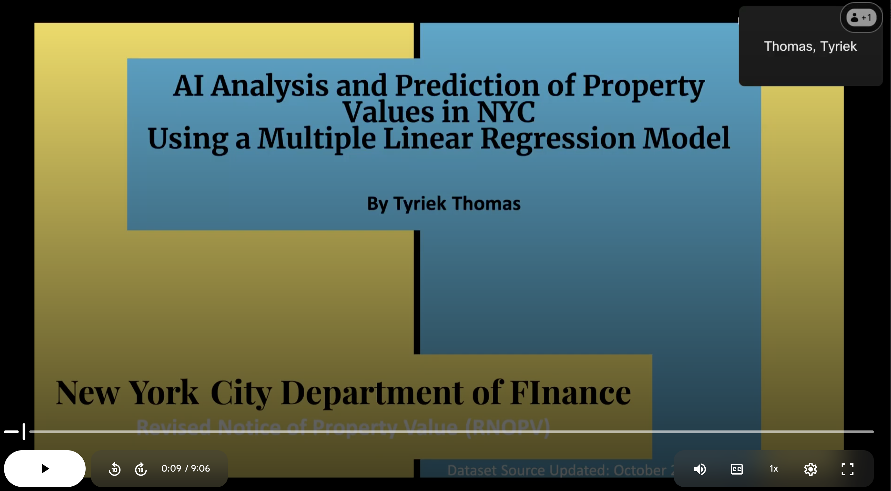

New York City Department of Finance
Revised Notice of Property Value (RNOPV)
# AI Analysis and Prediction of Property Values in NYC Using a Multiple Linear Regression Model
# By: Tyriek Thomas
** Python Jupyter Notebook – Google Colab**:  
[Prediction_of_Property_Values_in_NYC.ipynb (Open in Colab)](https://colab.research.google.com/drive/1qHTVfP3A2teo4toK1gl0JdCSo6MtDYzE?usp=sharing)

## Video Presentation  
[](https://drive.google.com/file/d/1Ueubw28rlulqzOrjcaMES0b-dDuXRC8z/view?usp=sharing)  
[Click me](https://drive.google.com/file/d/1Ueubw28rlulqzOrjcaMES0b-dDuXRC8z/view?usp=sharing)

---

## Slideshow Presentation  
[](https://docs.google.com/presentation/d/18tj92hkFsVPnvjZmd58wT2esmQMQkjVtVgfTBzB6cmA/edit?usp=sharing)  
[Click me](https://docs.google.com/presentation/d/18tj92hkFsVPnvjZmd58wT2esmQMQkjVtVgfTBzB6cmA/edit?usp=sharing)
Source: https://data.cityofnewyork.us/City-Government/Revised-Notice-of-Property-Value-RNOPV-/8vgb-zm6e


# Background on RNOPV
Revised Notice of Property Value

At the start of each year, the NYC Department of Finance contacts property owners to update them on their properties’ new “Revised Market Value” based on their previous “Original Market Value”, “Original Assessed Value”, and “Original Taxable Value” information that they received from the previous year.

A properties’ “Revised Market Value” can either increase, decrease or remain unchanged based on a number of different economic, tax based, or physical reasons.

For this project I will consider the perspective of a NYC property owner who would like to use the “Original Assessed Value”, “Original Taxable Value”, and “Original Market Value” from the previous year to predict the potential “Revised Market Value”

## Selecting Features From Dataset
Preprocessing the data from the NYC Department of Finance. I selected 7 features from the 39 features included in the dataset. 

Features were selected based on the weighted influence and contribution to the target feature.

Borough - More Precise Location within NYC
BLD Class - Type of building category determined by characteristics such as size/number of rooms can be ranked
Original Assessed Value 
Original Taxable Value
Original Market Value
Revised Market Value
RC1 - Reason Code 1 

# Preparing Features For Regression Model

## Categorical Data:
Borough - Nominal
RC1- Nominal
## Numerical Data:
Original Assed Value 
Original Taxable Value
Original Market Value
Revised Market Value 

## Target - Revised Market Value 

# Visualizing the Target For Regression Model


max=347,000,000
mean=3,020,000
q1=224,109
q2 median=443,000
q3=853,000
IQR = (q3 - q1)  - 50 percent of the data is squeezed in between 
the range of (224,109:853,000.
IQR = 853,000 - 224,109 = 628,891
Q3+(1.5*IQR) = Q3 + 943,336.5 = 853,000 + 943,336 = 1,896,336.5 (Upper Bound Error)
The target value consists of a broad range of property values in NYC ranging from a single family home  in Staten Island to MultiMillion dollar Skyscrapers in  Manhattan.
Due to such a broad range of numerical data? How accurate can my predictions be?
Very accurate thanks to the [RC 1] and [BOROUGH] categorical features.


# Visualizing the Numerical Features For Regression Model


Because we have the numerical features Original Assessed Taxable and Market values  along with the Revised values I can train my model make an accurate prediction for revised market value.

While yearly inflation is responsible for an expected increase in [REVISED MARKET VALUE], sometimes the housing market fluctuates and the market rates will be undervalued to meet demand.

In addition, the [ORIGINAL TAXABLE VALUE] is a variable that has a set formula to determine the taxable value based on the properties’ [ORIGINAL ASSESSED VALUE], properties can qualify for tax exemptions or even increases in taxes for the year based on reason codes [RC 1].

# Visualizing the Categorical Features For Regression Model


The reason code Rc 1 is responsible for explaining why there is a change in the original market value to the new revised market value.
RC 1:The reason codes are
E0 - was fully Sales Exempt now retsored to taxable status
E1 - Economics (deduction)
E4 - Economics (initiated by taxpayer)
M - MV 
P - Physical Change 
X - Exempt Value Change unless fully


The Borough is a very critical feature in training our model, duecause Manhattan is the most expensive places to own property in one the most expensive cities in the world. If about 50% of the dataset is from Manhattan Properties, it is important to distinguish the rows of data from other Boroughs where property values aren’t as high.

# Multiple Linear Regression Model Implementation
Can we predict numerical features such as the “Revised Market Value” for a specified property in NYC? 
By training our linear regression model with historical data and features that correlate with the target numerical feature, we can successfully estimate/predict a value that correlates with the given data.
Within a margin of statistical error.

# Train, Test and Split Multiple Linear Regression Model


## Result 
r2: 0.9328671776570595
The percentage of data having a variance that can be explained by the variance in the independent variables.
root mean squared error:3047891.8278787048
The average squared root of the error (y_test - y_pred)
The difference is squared, summed and averaged in order to handle negative and positive distances of the error. The root mean squared error can be used to calculate error bars(residuals).

## Insights:
Lets make a prediction or 2 
Comparing predicted "Revised Market Value" for properties in Manhatthan NY vs the Bronx NY


```python
px= pd.DataFrame({"ORIGINAL ASSESSED VALUE":[300000],"ORIGINAL TAXABLE VALUE":[300000],"ORIGINAL MARKET VALUE":[800000], "R_E0":[0], "R_E1":[1], "R_E4":[0], "R_M":[0], "R_P":[0], "R_X":[0], "BORO_BRONX":[1],"BORO_BROOKLYN":[0],"BORO_MANHATTAN":[0],"BORO_QUEENS":[0],"BORO_STATEN IS":[0] })
py= pd.DataFrame({"ORIGINAL ASSESSED VALUE":[300000],"ORIGINAL TAXABLE VALUE":[300000],"ORIGINAL MARKET VALUE":[800000], "R_E0":[0], "R_E1":[1], "R_E4":[0], "R_M":[0], "R_P":[0], "R_X":[0], "BORO_BRONX":[0],"BORO_BROOKLYN":[0],"BORO_MANHATTAN":[1],"BORO_QUEENS":[0],"BORO_STATEN IS":[0] })
pred1=model.predict(px)
print(pred1)

pred2=model.predict(py)
print(pred2)
```

    [1004156.48814242]
    [1606372.97454851]

Although the individual prediction of theoretical properties in NYC is insignificant the test was to determine if the trained model understood that properties in Manhatthan cost significantly more than the other boroughs even if the properties' attributes are very similar.
